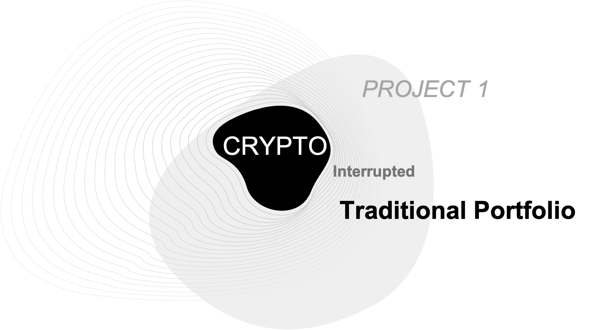
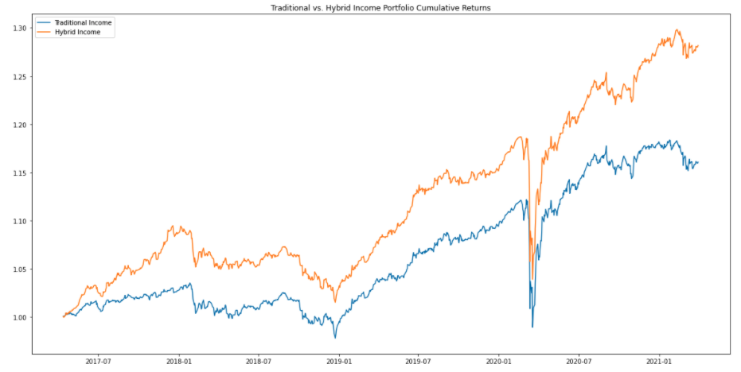
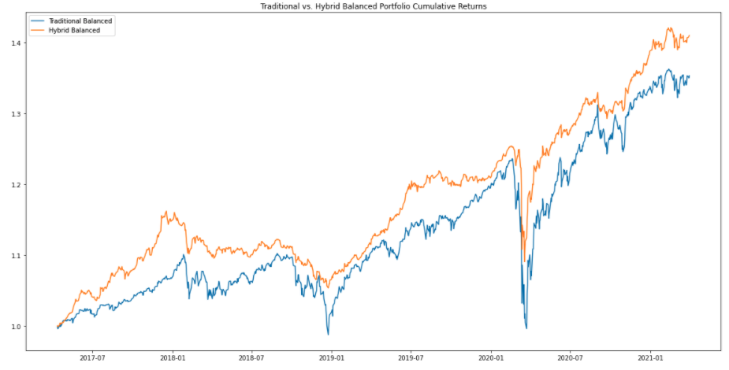
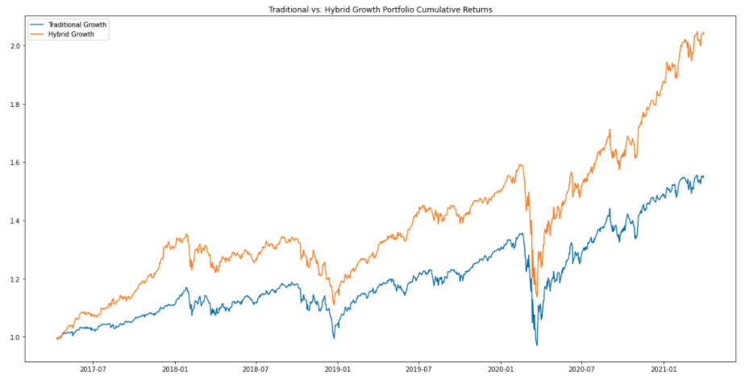
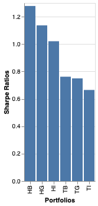

# Project_1
## Traditional Portfolio vs. Crypto

---
## Background:
For our project, we wanted to explore the impact of adding cryptocurrencies to traditional portfolios and then compare the returns and Sharpe ratios before and after doing so. First, we identified 3 industry-standard, benchmark portfolios: Income, Balanced, and Growth.
All three traditional portfolios are made up of a differing mix of bonds and equities. For our project, we used the Schwab US Aggregate ETF (NYSEARCA: SCHZ) to represent bonds and SPDR S&P 500 ETF Trust (NYSEARCA: SPY) to represent equities. The traditional portfolio breakdown is as follows:
* Traditional Income portfolio: 80% bonds, 20% equities
* Traditional Balanced portfolio: 50% bonds, 50% equities
* Traditional Growth portfolio: 20% bonds, 80% equities

The Major object of our project is to add certain percentage of Crypto Currency to each of the traditional portfolio to determine the the returns and Sharpe Ratio.

For our calculation purposes we have added 2% / 4% / 6% Crypto in the traditional income/Balanced.Growth portfolio distributed equally as the asset class.

After adding the Crypto currency to the following Traditional portfolio based on 2%/4%/6% the Hybrid Portfolio holding would be
* Hybrid Income Portfolio - 78.4% / 19.6% / 2%    
* Hybrid Balanced Portfolio - 48% / 48% / 4%         
* Hybrid Growth Portfolio - 18.8% / 75.2% / 6%

The rate of returns for the calculation are based on the cumulative returns.
As per our results we determine the outcome by adding a small percentage to the traditional portfolio based on the last 1000 days shown a substantially higher return compare to traditional portfolio.

---
## Observations:
### Cumulative Returns

As shown above the increase in Crypto assets creates a significant increase in overall Portfolio returns.  However, the asset type that the Crypto is replacing has a significant impact on the overall Portfolio return as shown in the Balanced Portfolio.  For example, if more bonds than stocks are being replaced by Crypto then overall increase in returns is more. If more stocks than bonds are replaced then the overall increase in returns is less.
### Sharpe Ratios

As shown above the Sharpe Ratio signficantly improved between the Traditional and Hybrid Portfolios based on the previous 1000 day returns.   As we increase the Crypto percentages the Sharpe Ratios are correspondingly increased.

---
